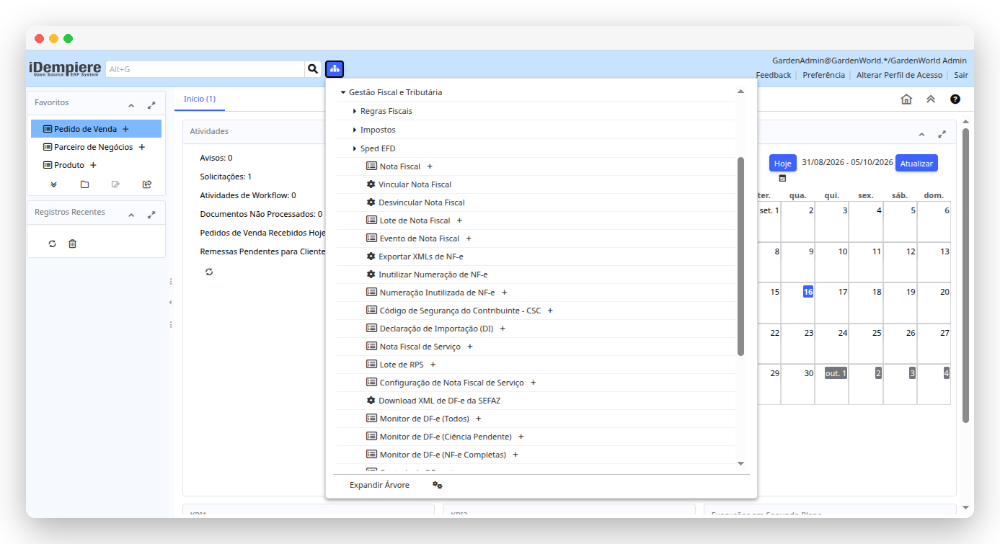
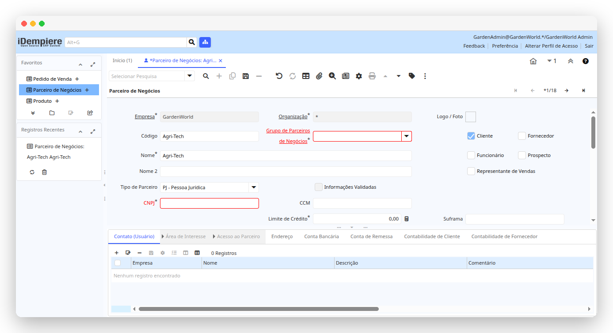
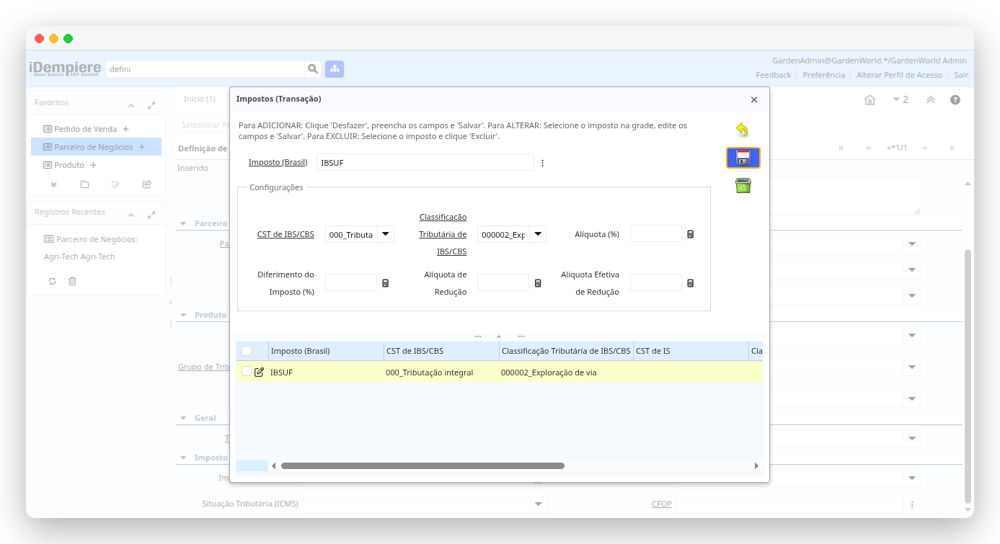
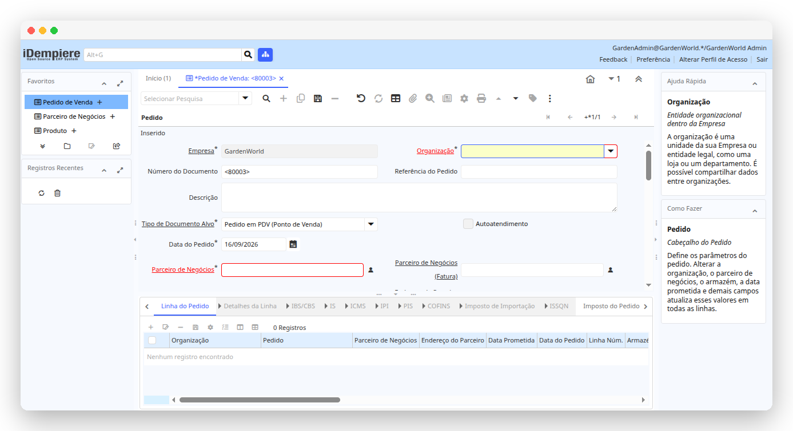
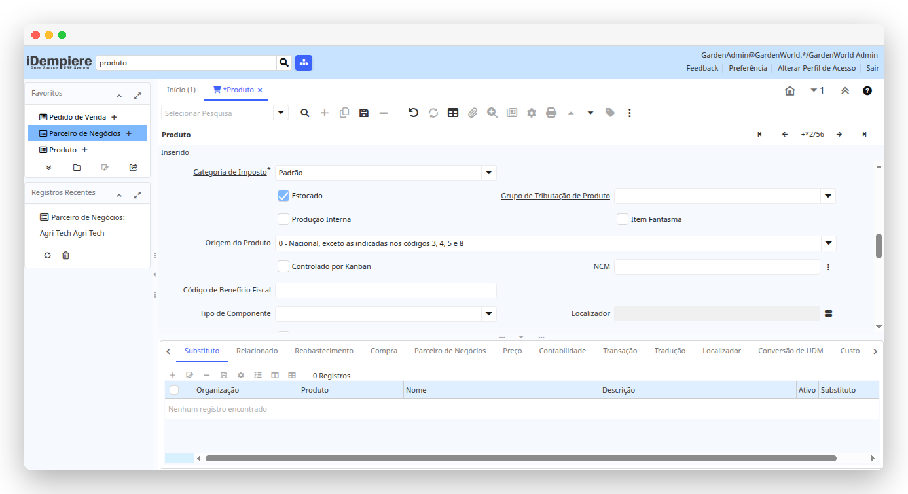
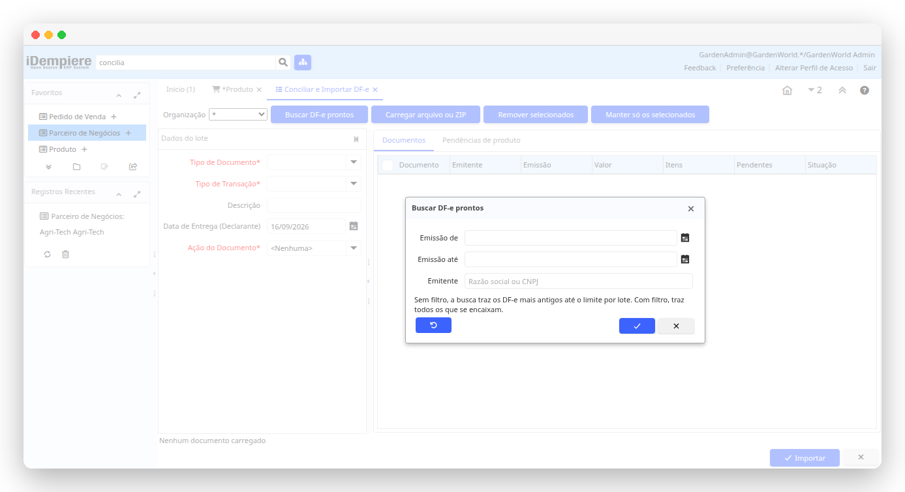

<div align="center">

# iDempiereLBR

**Localização brasileira para o [iDempiere Business Suite ERP/CRM/SCM](https://github.com/idempiere/idempiere)**

NF-e · NFC-e · NFS-e · Recepção de DF-e · SPED EFD · Boleto e CNAB 240 · IBS/CBS/IS

[](https://github.com/idempiere/idempiere)
[](https://adoptium.net/)
[](https://www.postgresql.org/)
[](https://www.nfe.fazenda.gov.br/)
[](#licença)

</div>

## Sumário

- [O que é](#o-que-é)
- [Módulos](#módulos)
- [Funcionalidades](#funcionalidades)
  - [Cadastros e localização](#cadastros-e-localização)
  - [Motor de impostos](#motor-de-impostos)
  - [NF-e e NFC-e — emissão](#nf-e-e-nfc-e--emissão)
  - [Recepção de DF-e — documentos de terceiros](#recepção-de-df-e--documentos-de-terceiros)
  - [Reforma tributária — IBS, CBS e IS](#reforma-tributária--ibs-cbs-e-is)
  - [NFS-e](#nfs-e)
  - [Cobrança — boleto e CNAB](#cobrança--boleto-e-cnab)
  - [SPED EFD](#sped-efd)
  - [Contabilidade](#contabilidade)
- [Compatibilidade](#compatibilidade)
- [Instalação](#instalação)
  - [1. iDempiere](#1-idempiere)
  - [2. Banco de dados com o seed do LBR](#2-banco-de-dados-com-o-seed-do-lbr)
  - [3. Compilando o LBR](#3-compilando-o-lbr)
  - [4a. Ambiente de desenvolvimento (Eclipse)](#4a-ambiente-de-desenvolvimento-eclipse)
  - [4b. Produção (console OSGi)](#4b-produção-console-osgi)
- [Configuração](#configuração)
- [Testes](#testes)
- [Como contribuir](#como-contribuir)
- [Agradecimentos](#agradecimentos)
- [Licença](#licença)

## O que é

O iDempiere é um ERP completo, mas sem nada do que o Brasil exige de um sistema
de gestão. O iDempiereLBR preenche essa lacuna: acrescenta o documento fiscal
brasileiro, o cálculo dos tributos, a conversa com a SEFAZ, os arquivos do SPED
e a cobrança bancária — além da tradução para pt\_BR e de um plano de contas
nacional.

> [!NOTE]
> O LBR **não é um fork** do iDempiere. São bundles OSGi que estendem o core
> pelos pontos de extensão oficiais (`ModelFactory`, `ITaxProvider`, `Callout`,
> `EventHandler`, `ProcessFactory`, `FormFactory`, `DocFactory`). Atualizar o
> iDempiere não significa refazer merge de localização.



## Módulos

| Bundle | Responsabilidade |
|---|---|
| `org.idempierelbr.base` | Modelo de dados do LBR: Nota Fiscal, detalhes de imposto por linha, NCM, CEST, CFOP, certificado digital, boleto, DI. É o bundle que todos os outros usam. |
| `org.idempierelbr.core` | Validação de CNPJ/CPF/IE, endereço brasileiro, busca por CEP, plano de contas e traduções pt\_BR. |
| `org.idempierelbr.tax` | Motor de cálculo dos tributos: provedor de imposto, matrizes, definição de impostos, diálogo de ajuste manual, contabilização do imposto. |
| `org.idempierelbr.nfe` | NF-e e NFC-e: geração e assinatura do XML, comunicação com a SEFAZ, eventos, DANFE, recepção e importação de DF-e. |
| `org.idempierelbr.nfs` | NFS-e (RPS): estrutura de emissão, lote, cancelamento e envio, no padrão ABRASF. |
| `org.idempierelbr.sped` | SPED EFD ICMS/IPI e EFD Contribuições, com apuração de imposto. |
| `org.idempierelbr.open-items` | Boleto bancário, geração e retorno de arquivos CNAB, instruções bancárias. |
| `org.idempierelbr.cnab240` + `…febraban`, `…bancodobrasil`, `…banrisul`, `…bradesco`, `…caixa`, `…itau`, `…santander`, `…sicoob` | Layouts CNAB 240 por banco, cada um em seu bundle, plugáveis por `IBankCollectionFactory`. |
| `org.idempierelbr.jasperfonts` | Fragmento de fontes para o JasperReports (DANFE e boleto saem com a fonte certa). |
| `org.idempierelbr.test` | Testes unitários e de integração (JUnit 5). |

## Funcionalidades

### Cadastros e localização

- **Parceiro de Negócios para PF e PJ** — CNPJ, CPF, Inscrição Estadual e
  Municipal, Suframa, com validação de dígito verificador e de duplicidade.
- **Cadastro unificado de filiais** (opcional) — matriz e filiais no mesmo
  Parceiro de Negócios, cada uma com seu CNPJ e IE na aba Localização.
- **Endereço brasileiro** — diálogo de localização próprio, com logradouro,
  número, complemento, bairro e município do IBGE.
- **Busca de endereço por CEP** — preenche o endereço a partir do CEP digitado.
- **Tradução pt\_BR** — feita por profissionais da área fiscal e contábil, não
  por tradução automática.




### Motor de impostos

Os tributos são calculados pelo provedor de imposto do LBR, registrado no
mecanismo de `ITaxProvider` do iDempiere — ou seja, o cálculo acontece no
pedido, na fatura, na remessa e na RMA, como parte do fluxo normal do ERP.

- **Tributos cobertos** — ICMS (próprio, ST, redução de base, DIFAL/`ICMSUFDest`,
  Simples Nacional), IPI, PIS, COFINS (inclusive ST), ISSQN, Imposto de
  Importação, IBS, CBS e IS.
- **Regras fiscais configuráveis** — **Configuração de Impostos**,
  **Definição de Impostos**, **Grupo de Tributação** (de Produto, de Parceiro de
  Negócios e de NF), **Matriz de ICMS** (origem × destino) e **Matriz de ISS**.
- **Fórmulas de imposto** — **Fórmula de Imposto (Brasil)** permite expressar o
  cálculo de cada tributo sem alterar código.
- **CFOP automático** — escolhido pela operação (compra, venda, devolução,
  transferência), pela origem/destino e pelas categorias de CFOP do produto e do
  parceiro.
- **Ajuste manual por linha** — o diálogo de impostos abre na linha do
  documento, mostra base, alíquota e valor de cada tributo e permite corrigir
  antes de completar o documento.
- **NCM, CEST e monofásicos** — cadastros próprios (**NCM**, **CEST**,
  **Relação de CEST com NCM e Produto**, **Monophase NCM**) usados pelo cálculo
  e pelo XML.
- **Valor Aproximado dos Tributos** (Lei 12.741/2012) — com importação do
  arquivo **"De Olho no Imposto" do IBPT**.
- **Mensagens legais** — texto fiscal por operação, que sai nas informações
  complementares do documento.
- **Distribuir Valor aos Detalhes** — rateia frete, seguro, desconto ou despesa
  acessória entre as linhas, na proporção certa e com tratamento do resíduo de
  arredondamento.
- **Declaração de Importação (DI)** — DI, adições e vínculo com o produto,
  incluindo a FCI (número de controle por item).







### NF-e e NFC-e — emissão

Layout **NF-e 4.00**, modelos **55** (NF-e) e **65** (NFC-e).

- **Nota Fiscal** — o documento fiscal brasileiro, com todos os grupos do
  layout: produtos, tributos por item, transporte e volumes, cobrança e
  duplicatas, formas de pagamento, documentos referenciados, combustíveis,
  intermediador, comércio exterior.
- **Gerar Nota Fiscal** — cria a Nota Fiscal a partir do Pedido, da Fatura, da
  Remessa ou da RMA, trazendo os impostos já calculados.
- **Certificado Digital** — cadastro de A1 (PKCS#12), A3/token (PKCS#11), JKS
  ou TrustStore da ICP-Brasil, com processo de validação e geração dos
  certificados dos web services da SEFAZ.
- **Lote de Nota Fiscal** — envio à SEFAZ em processamento **síncrono ou
  assíncrono**, com **Consultar Recibo na Sefaz** para o retorno do lote.
  O lote pode ser criado automaticamente ao completar a nota.
- **Contingência** — o tipo de emissão da nota cobre os modos previstos pela
  SEFAZ (SVC-AN, SVC-RS, FS-DA, off-line para NFC-e, entre outros), para quando
  o autorizador está indisponível.
- **Eventos de NF-e** — **Cancelamento**, **Carta de Correção (CC-e)** e
  **Manifestação do Destinatário**, cada um com seu lote de envio.
- **Inutilizar Numeração de NF-e** — e a janela **Numeração Inutilizada** com o
  protocolo.
- **DANFE** — impressão em retrato A4, DANFE simplificado, **DANFE NFC-e** (com
  QR Code e CSC) e DANFE NFC-e por mensagem eletrônica.
- **Exportar XMLs de NF-e** — extração dos XMLs autorizados por período.
- **Vincular / Desvincular Nota Fiscal** — liga a Nota Fiscal aos documentos do
  ERP quando o vínculo precisa ser refeito.
- **Código de Segurança do Contribuinte (CSC)** — cadastro por organização,
  usado no QR Code da NFC-e.
- **Contabilização própria** — a Nota Fiscal tem seu próprio motor contábil
  (`Doc_NotaFiscal`), e os impostos entram no lançamento.

### Recepção de DF-e — documentos de terceiros

O caminho completo do documento que **chega**: baixar da SEFAZ, manifestar,
conciliar produtos e virar documento no ERP.

- **Download XML de DF-e da SEFAZ** — consulta a distribuição de DF-e
  (`NFeDistribuicaoDFe`) por NSU, com paginação, dedup por NSU e por chave e
  proteção contra o bloqueio por consumo indevido (cStat 656).
- **Controle de DF-e** — ponto de leitura (último NSU), último retorno da SEFAZ
  e até quando a próxima consulta está bloqueada.
- **Monitor de DF-e** — três visões da fila: **Todos**, **Ciência Pendente**
  (resumos que aguardam manifestação) e **NF-e Completas** (XML integral já
  disponível, pronto para importar).
- **Manifestação do destinatário** — Ciência da Operação, Confirmação,
  Desconhecimento e Operação não Realizada, com envio em seleção múltipla a
  partir do monitor.
- **Eventos de DF-e Recebidos** — eventos que a distribuição entrega sobre os
  documentos (cancelamento e CC-e de terceiros, entre outros), vinculados à nota
  correspondente.
- **Conciliar e Importar DF-e** — a tela de trabalho de quem recebe nota de
  fornecedor. Trabalha **em lote** e por **duas entradas de igual peso**: os
  DF-e que a SEFAZ já entregou, ou um **XML/ZIP** que chegou por e-mail. A
  cascata de de‑para resolve os produtos que dá para resolver e só o que precisa
  de decisão vai para a fila de pendências; cada vínculo resolvido é aplicado ao
  restante do lote e gravado no cadastro do fornecedor, então a mesma pendência
  não volta na próxima importação. Cada nota é importada em sua própria
  transação — uma nota problemática não derruba o lote.
- **Gerar Fatura** direto do DF-e — para quem recebe a nota, não movimenta
  estoque e só precisa do compromisso financeiro; quando o emitente informou o
  grupo `cobr`, as duplicatas viram o cronograma da fatura.
- **Gerar Pedido de Compra** a partir da Nota Fiscal importada — com depósito,
  lista de preços e condição de pagamento como parâmetros.
- **Gerar DANFE** do documento recebido, a partir do XML da distribuição.



### Reforma tributária — IBS, CBS e IS

O LBR acompanha a **NT 2025.002** (grupos IBS/CBS/IS no layout da NF-e):

- **Tributos por item** — IBS (UF e município), CBS e IS, com CST e Classificação
  Tributária próprias (**CST e Classificação Tributária de IBS/CBS** e
  **… de IS**), incluindo os grupos de totalização do XML.
- **NF-e de Débito e de Crédito** (`finNFe` 5 e 6) — os 13 tipos da NT, com as
  regras de referência, direção e tributos admitidos de cada um; o processo
  **Generate Debit/Credit NF-e** monta a nota como réplica proporcional do
  documento de origem (NF-e, Pedido, Fatura, RMA ou Remessa).
- **Pagamento antecipado** — grupo `gPagAntecipado`: a NF-e de fornecimento
  referencia automaticamente as notas de débito tipo 06 já emitidas, para que o
  IBS/CBS não seja cobrado duas vezes.
- **Nota de Débito automática de juros e multa** — no retorno CNAB, cada
  liquidação com juros/multa pode gerar, completar e enviar à SEFAZ a nota de
  débito correspondente (opcional, por configuração).

> [!NOTE]
> A configuração da finalidade e do subtipo fica no **Tipo de Documento**, e o
> CFOP vem da **Definição de Impostos** — o objetivo é sobreviver a revisões de
> Ajuste SINIEF sem precisar de nova versão do plugin.

### NFS-e

- **Nota Fiscal de Serviço** e **Lote de RPS**, com **Configuração de Nota
  Fiscal de Serviço** por município (web service, credenciais, ambiente).
- Processos de **Transmitir**, **Consultar Lote**, **Cancelar**, **Imprimir
  DANFE** e **Enviar por e-Mail**.
- Estrutura no padrão **ABRASF**: a integração com o provedor do município entra
  por `INFSeFactory`, em um bundle próprio, sem alterar o LBR.

### Cobrança — boleto e CNAB

- **Boleto Bancário** — emissão pela empresa (PDF via JasperReports) ou pelo
  banco, com carteiras, convênios, juros, multa, desconto e instruções.
- **Padrão de Cobrança Bancária** — os defaults de cada conta/carteira, para não
  repetir configuração em cada boleto.
- **CNAB 240** — arquivo de **remessa** e processamento do **retorno**, com
  **Arquivo CNAB**, **Código de Movimento** e **Grupo de Ocorrências**.
- **Bancos com layout próprio** — Banco do Brasil, Banrisul, Bradesco, Caixa,
  Itaú, Santander, Sicoob e o layout **Febraban** genérico. Cada banco é um
  bundle: adicionar um novo não mexe nos outros.
- **Gerar Instruções Bancárias** — comanda um movimento de cobrança (baixa,
  protesto e o que mais estiver cadastrado em **Código de Movimento**) sobre um
  boleto ou sobre todos os boletos de uma fatura; o comando sai no próximo
  arquivo de remessa.
- **Relatórios** — Boletos em Aberto, Detalhes de Boletos e Resumo de Boletos.

### SPED EFD

- **Gerador SPED EFD** — geração do arquivo, com **Configuração do SPED** por
  organização.
- **EFD ICMS/IPI** — blocos 0, C, D, E, G, H, 1 e 9.
- **EFD Contribuições (PIS/COFINS)** — blocos 0, A, C, D, F, M, 1 e 9.
- **Apuração de ICMS e IPI** — janela e processo de apuração, que alimenta o
  bloco E.
- Os documentos fiscais que alimentam o SPED são lidos dos registros do próprio
  LBR (Nota Fiscal e detalhes por linha), não de uma digitação paralela.

### Contabilidade

- **Plano de contas brasileiro** pronto para importar
  (`org.idempierelbr.core/data/import/AccountingBR.csv`) — 329 contas na
  estrutura Ativo / Passivo / Receitas / Custos e Despesas.
- **Contabilização dos impostos** — lançamentos de fatura, remessa e conciliação
  de pedido passam pelos documentos contábeis do LBR, que tratam os tributos
  brasileiros (recuperáveis e não recuperáveis).

## Compatibilidade

Cada branch do LBR acompanha uma versão do iDempiere:

| Branch do LBR | iDempiere | Java | Situação |
|---|---|---|---|
| `release-13` | 13 | 17 | **Em desenvolvimento ativo** |
| `master` | 13 | 17 | Acompanha a `release-13` (merge por PR) |
| `release-12` | 12 | 17 | Manutenção |
| `release-11` | 11 | 17 | Manutenção |
| `release-10` | 10 | 11 | Legado |

- Banco de dados: **PostgreSQL** (o seed distribuído é `iDempiere_pg.jar`).
- Layouts fiscais: NF-e/NFC-e 4.00 com NT 2025.002 (IBS/CBS/IS), CNAB 240,
  SPED EFD ICMS/IPI e EFD Contribuições, NFS-e padrão ABRASF.

## Instalação

### 1. iDempiere

Instale o iDempiere primeiro, seguindo a **documentação oficial** — o LBR não
substitui nenhum passo dela:

👉 <https://docs.idempiere.org/docs/category/basic-installation>

Escolha o caminho conforme o seu objetivo:
[Installing for Execution](https://docs.idempiere.org/docs/category/installing-for-execution)
(produção) ou
[Installing for Development](https://docs.idempiere.org/docs/category/installing-for-development)
(Eclipse).

Use a branch do iDempiere correspondente à branch do LBR — por exemplo
`release-13` em ambos.

### 2. Banco de dados com o seed do LBR

Há **um único desvio** em relação à documentação oficial: na etapa de importação
do seed, use o jar do LBR em vez do jar do core.

```bash
# em vez de:
# jar xvf $IDEMPIERE_REPOSITORY/org.adempiere.server-feature/data/seed/Adempiere_pg.jar
jar xvf $LBR_REPOSITORY/org.idempierelbr.core/data/seed/iDempiere_pg.jar
```

Esse jar é o seed do iDempiere com o dicionário, os dados e as traduções do LBR
já aplicados.

> [!IMPORTANT]
> Este repositório não traz um pacote 2Pack para aplicar o LBR sobre um banco
> que já roda sem ele. O caminho suportado é partir do seed do LBR.

### 3. Compilando o LBR

O build resolve o core pelo repositório p2 gerado pelo próprio iDempiere, então
os dois clones ficam lado a lado:

```
sources/
├── idempiere/       # clone do iDempiere (branch release-13), já compilado
└── idempierelbr/    # este repositório
```

```bash
git clone https://github.com/idempiere/idempiere.git
git clone https://github.com/idempierelbr/idempierelbr.git

cd idempiere      && git switch release-13 && mvn verify   # gera o p2 do core
cd ../idempierelbr && git switch release-13 && mvn verify   # compila o LBR
```

> [!TIP]
> Se o seu clone do iDempiere tiver outro nome ou caminho, ajuste a propriedade
> `idempiere.core.repository.url` em
> `org.idempierelbr.extensions.parent/pom.xml` — é o único lugar que aponta para
> o core.

O que o `mvn verify` produz:

- um jar por bundle em `org.idempierelbr.<módulo>/target/`;
- um repositório p2 com todos os bundles em
  `org.idempierelbr.extensions.p2/target/repository/`;
- as bibliotecas de terceiros que vêm do `local-maven-repo/` copiadas para o
  `lib/` dos bundles que as declaram (por isso vale rodar o build **antes** de
  compilar no Eclipse).

> [!TIP]
> Alguns bundles carregam jars de terceiros em `lib/`, declarados no
> `Bundle-ClassPath` do `MANIFEST.MF`. Parte deles está versionada no
> repositório e parte é copiada pelo `mvn verify`. Se a compilação reclamar de
> um jar ausente em `lib/`, é esse o ponto a conferir — o `HowToBuild.txt`
> mostra como publicar um jar avulso no `local-maven-repo`.

### 4a. Ambiente de desenvolvimento (Eclipse)

1. No workspace que já tem os projetos do iDempiere, importe os do LBR:
   **File → Import → General → Existing Projects into Workspace**, apontando
   para a raiz do clone do LBR. Marque todos os `org.idempierelbr.*`.
2. Abra o arquivo **`lbr.server.product.launch`**, na raiz do repositório. É o
   `server.product` do iDempiere com os bundles do LBR já marcados.
3. Clique com o botão direito → **Run As → lbr.server.product**.

Para usar um launch próprio em vez desse, abra a aba **Plug-ins** do seu launch
e marque os bundles `org.idempierelbr.*`. Mantenha
`automaticAdd`/`automaticIncludeRequirements` ligados (**Add Required
Plug-ins**) para o Eclipse resolver as dependências OSGi.

> [!NOTE]
> `org.idempierelbr.jasperfonts` é um **fragmento** de
> `net.sf.jasperreports.engine`: ele é carregado junto com o host e não aparece
> como bundle iniciável.

### 4b. Produção (console OSGi)

Não há repositório p2 público: compile localmente (passo 3) e instale os jars no
servidor.

1. Copie os jars para o servidor. O repositório p2 gerado pelo build já contém
   exatamente os bundles de produção, com o qualifier de versão resolvido e sem
   o bundle de testes:

   ```bash
   scp org.idempierelbr.extensions.p2/target/repository/plugins/org.idempierelbr.*.jar \
       servidor:/opt/idempiere-server/plugins/
   ```

2. Abra o console OSGi do iDempiere — por telnet
   (`telnet localhost 12612`) ou pelo console web
   (`https://<servidor>:8443/osgi/system/console/bundles`, com um usuário
   System Admin).

3. Instale cada bundle, **na ordem das dependências** (`base` → `core` →
   `tax` → demais):

   ```
   osgi> install file:/opt/idempiere-server/plugins/org.idempierelbr.base_13.0.0.<qualifier>.jar
   Bundle id is 123
   osgi> setbsl 5 123
   osgi> sta 123
   ```

   Repita para `core`, `tax`, `nfe`, `nfs`, `sped`, `open-items`, `cnab240`, os
   bundles de banco e `jasperfonts` (este último apenas `install`: é fragmento).
   Use `ss org.idempierelbr` para conferir se todos ficaram **ACTIVE** (o
   fragmento fica **RESOLVED**).

4. Reinicie o servidor iDempiere e confira o menu **Gestão Fiscal e Tributária**.

Para atualizar depois, `update <id>` no bundle correspondente (ou `uninstall` +
`install` da nova versão). Detalhes e alternativas na wiki do iDempiere:
[Manage Plugin](https://wiki.idempiere.org/en/Manage_Plugin).

## Configuração

- **[Configurações de sistema (SysConfig) do LBR](docs/sysconfig.md)** — o que
  cada uma faz, valores aceitos, padrões e nível (Cliente/Organização).

Antes de emitir o primeiro documento, configure ao menos:

| Onde | O que |
|---|---|
| **Parceiro de Negócios vinculado à organização** | razão social, CNPJ, IE e Inscrição Municipal — é daí que o LBR monta o emitente do XML |
| **Informação da Organização** | CNAE e os certificados digitais (da organização e de transmissão) |
| **Certificado Digital** | certificado A1/A3, validado pelo processo **Validar o Certificado Digital** |
| **NF-e Web Service** | ambiente (homologação/produção) e autorizador da UF |
| **Tipo de Documento** | modelo (55/65), série e se o documento é emitido pela organização |
| **Configuração de Impostos** / **Definição de Impostos** | as regras fiscais da empresa |
| **Código de Segurança do Contribuinte** | apenas para NFC-e |
| **Configurador do Sistema** | regime tributário (`LBR_ICMS_REGIME`), fuso horário e as demais [SysConfig do LBR](docs/sysconfig.md) |

## Testes

Os testes ficam em `org.idempierelbr.test`:

- **Testes unitários** (`*Test.java`) — lógica pura, sem banco: parser de XML,
  regras da NT 2025.002, ordem de elementos do XML, filtros de DF-e, utilitários
  de NF-e. Rodam no `mvn verify` (Tycho, JUnit 5).
- **Testes de integração** (`*IT.java`) — precisam do `Adempiere.startup` e de
  banco/rede: certificado digital, web services da SEFAZ. Rodam como
  **JUnit Plug-in Test** no Eclipse.

O projeto inclui um launch pronto para os testes de integração, já com os
bundles OSGi sem os quais o `Adempiere.startup` fica travado aguardando o
`EventManager` (`org.eclipse.equinox.event`, `org.apache.felix.scr`):

1. Abra `org.idempierelbr.test/org.idempierelbr.test.launch`.
2. Botão direito → **Run As → org.idempierelbr.test**.

O launch resolve o `IDEMPIERE_HOME` por `${project_loc:org.adempiere.base}/..`,
então funciona em qualquer máquina que tenha o `org.adempiere.base` no
workspace. Ao criar novos launches de teste, mantenha `automaticAdd=true` e
`automaticIncludeRequirements=true`.

## Como contribuir

Contribuições são bem-vindas — correções de layout fiscal, novos bancos CNAB,
provedores de NFS-e, testes.

- Abra a PR contra a branch da versão correspondente (ex. `release-13`).
- Mudanças de dicionário (tabelas, colunas, janelas, processos) são feitas pelo
  **Application Dictionary** e precisam vir descritas na PR, para que possam ser
  reproduzidas. É necessário também utilizar o servidor de ID centralizado.
- Rode `mvn verify` antes de abrir a PR.

Problemas e dúvidas: [issues](https://github.com/idempierelbr/idempierelbr/issues).

## Agradecimentos

Devemos reconhecer o esforço de todos os colaboradores deste projeto e dos
antecessores, especialmente o time **ADempiereLBR**. Sabemos das longas horas
investidas para adaptar este incrível ERP à realidade brasileira. Cabe mencionar
que em todas as classes trazidas ao projeto iDempiereLBR mantivemos a referência
dos autores das mesmas.

## Licença

Distribuído nos termos da **GNU General Public License, versão 2**, a mesma
licença do cabeçalho dos arquivos-fonte do projeto.
